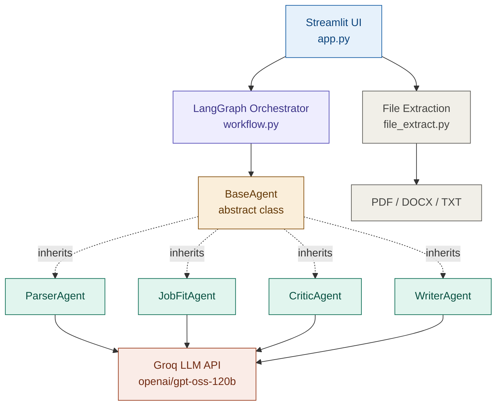

```mermaid
graph TD
    A[Streamlit UI<br/>app.py]:::ui --> B[LangGraph Orchestrator<br/>workflow.py]:::orchestrator
    B --> Base[BaseAgent<br/>abstract class]:::base
    Base -.inherits.-> C1[ParserAgent]:::agent
    Base -.inherits.-> C2[JobFitAgent]:::agent
    Base -.inherits.-> C3[CriticAgent]:::agent
    Base -.inherits.-> C4[WriterAgent]:::agent
    C1 --> D[Groq LLM API<br/>openai/gpt-oss-120b]:::llm
    C2 --> D
    C3 --> D
    C4 --> D
    A --> E[File Extraction<br/>file_extract.py]:::util
    E --> F[PDF / DOCX / TXT]:::util

    classDef ui fill:#E6F1FB,stroke:#185FA5,stroke-width:1px,color:#0C447C
    classDef orchestrator fill:#EEEDFE,stroke:#534AB7,stroke-width:1px,color:#3C3489
    classDef base fill:#FAEEDA,stroke:#854F0B,stroke-width:1px,color:#633806
    classDef agent fill:#E1F5EE,stroke:#0F6E56,stroke-width:1px,color:#085041
    classDef llm fill:#FAECE7,stroke:#993C1D,stroke-width:1px,color:#712B13
    classDef util fill:#F1EFE8,stroke:#5F5E5A,stroke-width:1px,color:#444441
```