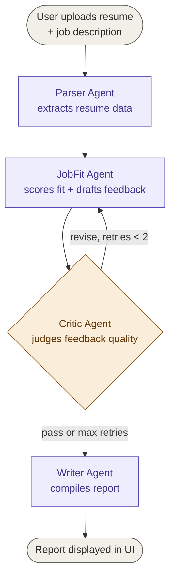

```mermaid
flowchart TD
    Start([User uploads resume<br/>+ job description]):::start --> Parser[Parser Agent<br/>extracts resume data]:::agent
    Parser --> JobFit[JobFit Agent<br/>scores fit + drafts feedback]:::agent
    JobFit --> Critic{Critic Agent<br/>judges feedback quality}:::critic
    Critic -->|revise, retries < 2| JobFit
    Critic -->|pass or max retries| Writer[Writer Agent<br/>compiles report]:::agent
    Writer --> End([Report displayed in UI]):::start

    classDef start fill:#F1EFE8,stroke:#5F5E5A,stroke-width:1px,color:#2C2C2A
    classDef agent fill:#EEEDFE,stroke:#534AB7,stroke-width:1px,color:#3C3489
    classDef critic fill:#FAEEDA,stroke:#854F0B,stroke-width:1px,color:#633806
```