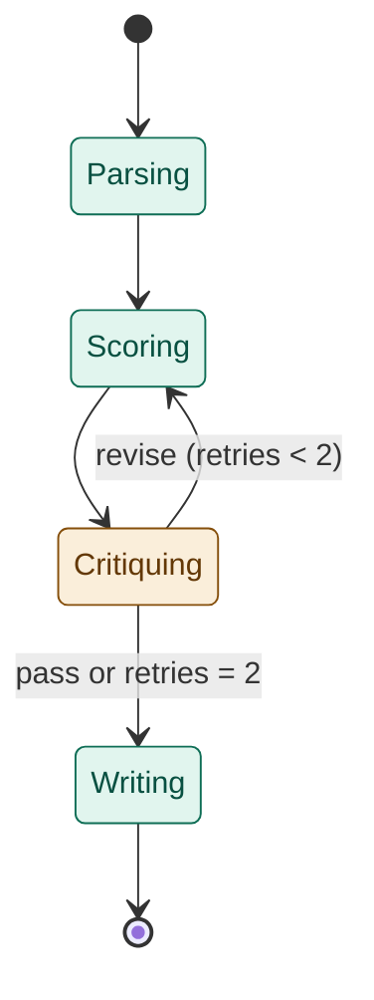

```mermaid
stateDiagram
    [*] --> Parsing
    Parsing --> Scoring
    Scoring --> Critiquing
    Critiquing --> Scoring: revise (retries < 2)
    Critiquing --> Writing: pass or retries = 2
    Writing --> [*]

    classDef stateStyle fill:#E1F5EE,stroke:#0F6E56,stroke-width:1px,color:#085041
    classDef critiqueStyle fill:#FAEEDA,stroke:#854F0B,stroke-width:1px,color:#633806
    class Parsing,Scoring,Writing stateStyle
    class Critiquing critiqueStyle
```